# SQL-TASK1
 i was given this SQL task to measure my learning process and what i've learnt so far, here is the task question 

 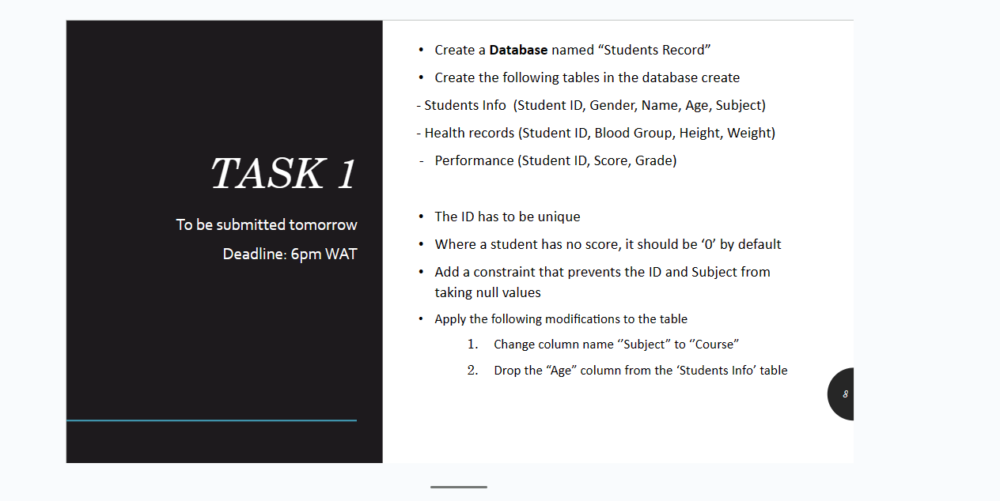
 ---
  the first question, i created a database called STUDENT_RECORD using the syntax  shown in the following image

  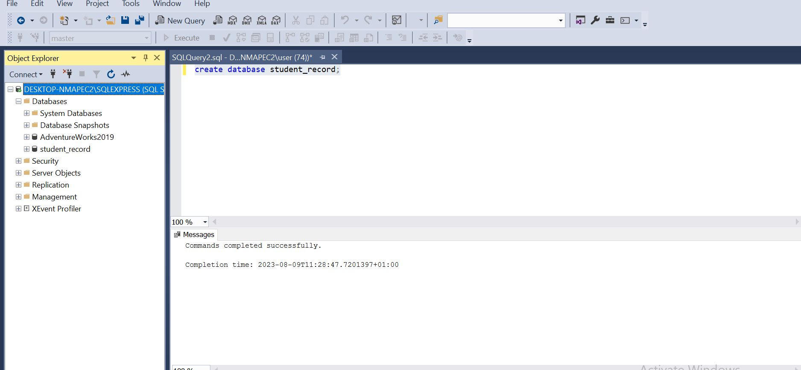

  ---
  so i created three tables inside the database with the following columns, and inserted values into them just as stated, 
  
  1.   STUDENT_INFO (studentID, Gender, Name, Age, Subject).
  2.   HEALTH_RECORDS (studentID, Bloodgroup.height, weight).
  3.   PERFOMANCE (studentID, score, Grade).
  
  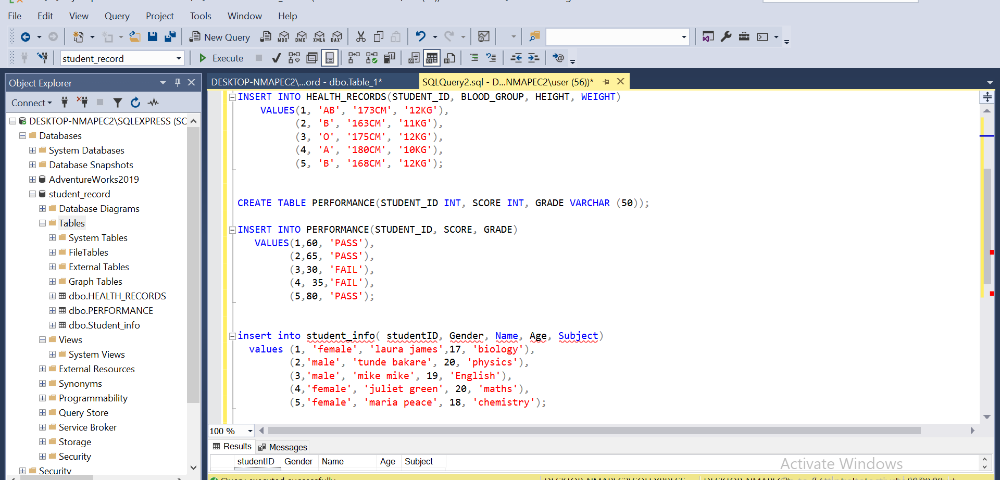

  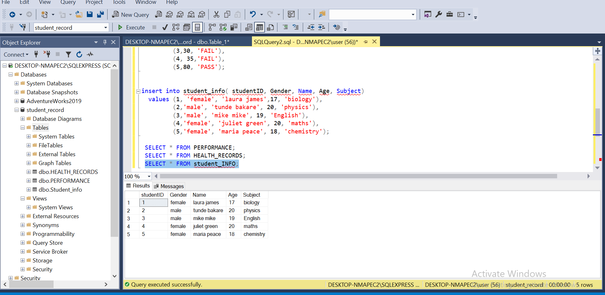

  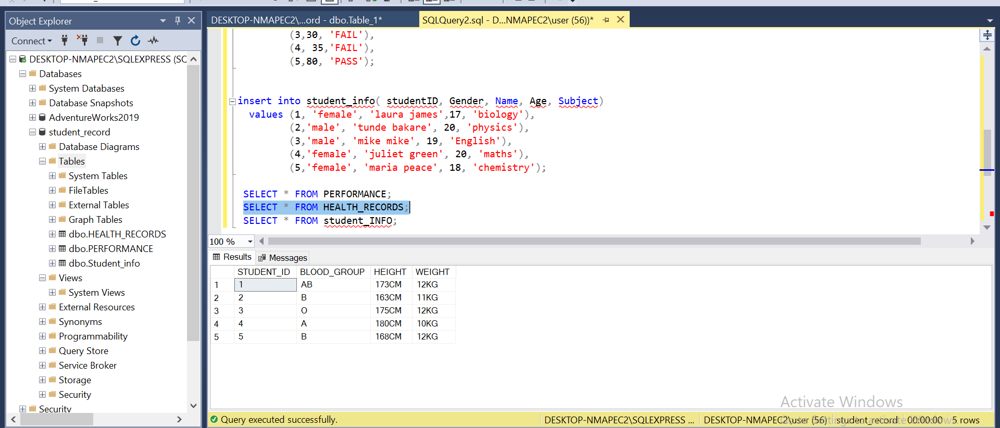
  
   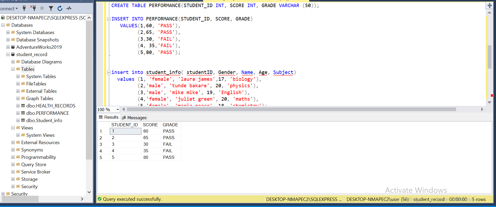

   the images above shows the SYNTAX used in creating the tables and inserting values into the table.
   
   --

   i proceeded and added a constraint each for both the ID and subject, preventing it from taking null values.
   because i already created the table before , i had to ALTER it to include the data types and constraint.
   the contraint are added to help enforce specific rules and prevent the insertion of invalid or inconsistent data.

   i added the PRIMARY KEY to the student ID which is the first, then a not null constraint to the subject as instructed

   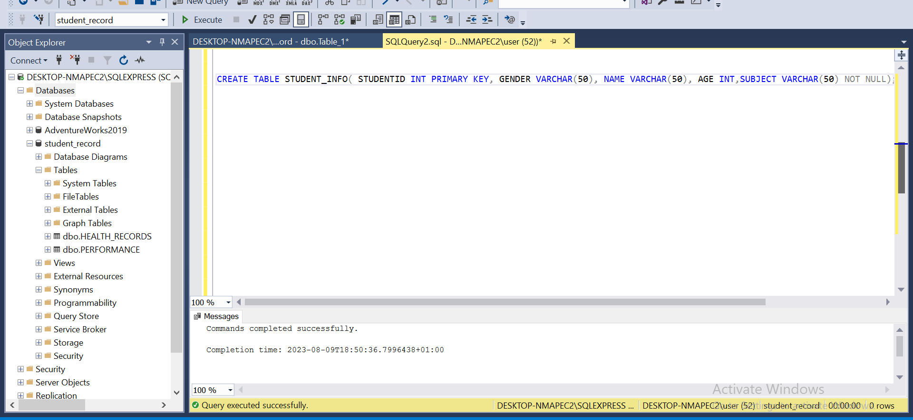

The final part of the task, i was asked to apply the following modifications to the tables.
  * change column name "SUBJECT" to "COURSE"
  * Drop the "Age" column from the STUDENT_INFO table.

the rename clause is not active in the version of SQL SERVER i use, so i did manually
 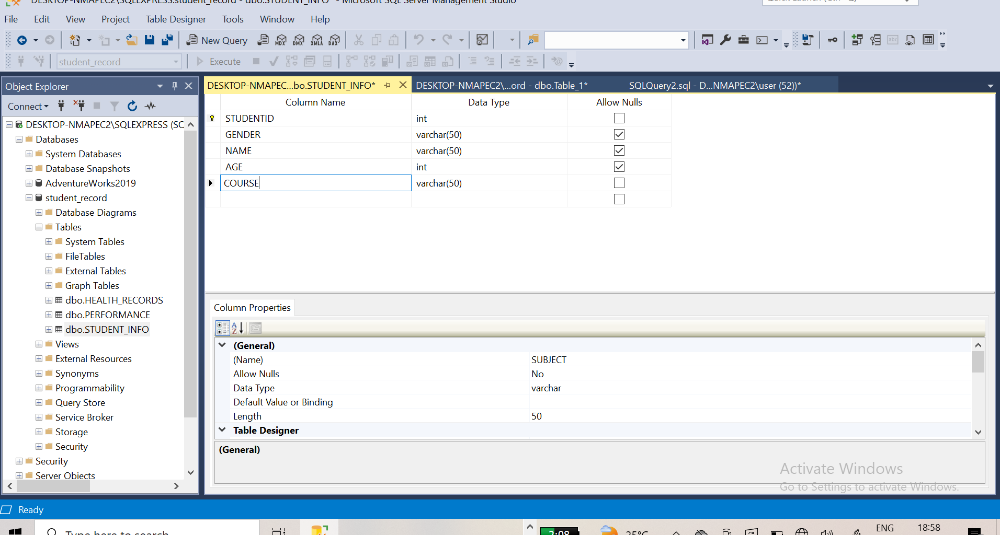

 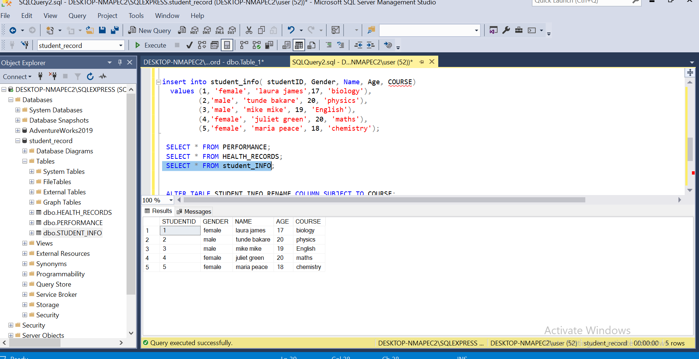 
  we can see from the above image that the column name has been changed.

  finally, using the ALTER clause i DROPPED the AGE column.
 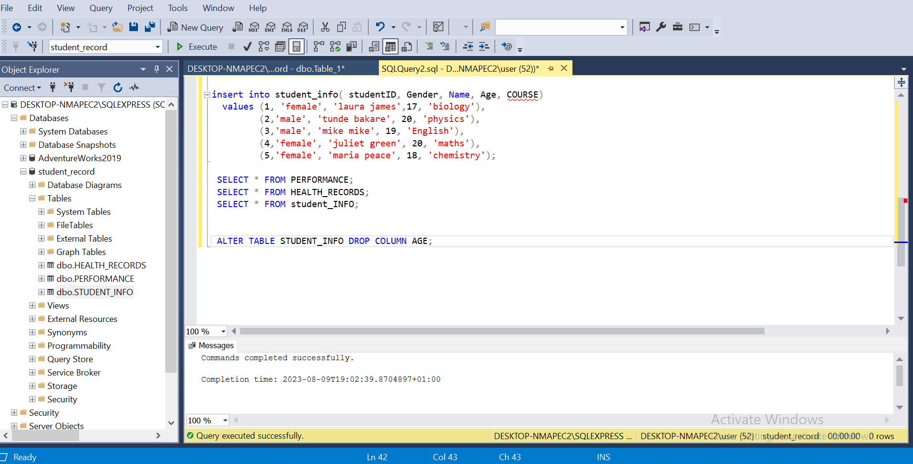
 
 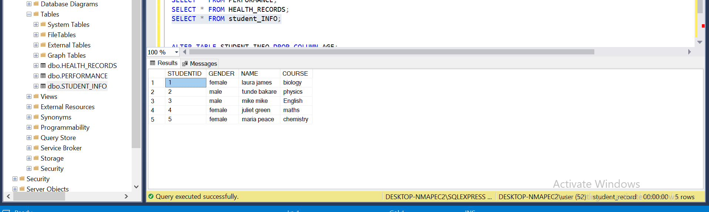

  so, i believe with the right syntax the task questions have all been answered.

    
    
    
     

    
     
    
    
    

    
   

   
   

  
   
    
    
  
    
    
    
